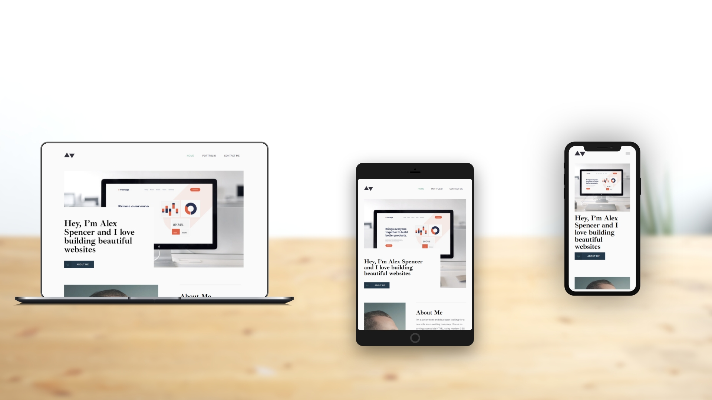

# Minimalist portfolio website

This is a solution to the [Minimalist portfolio website challenge on Frontend Mentor](https://www.frontendmentor.io/challenges/minimalist-portfolio-website-LMy-ZRyiE). Frontend Mentor challenges help you improve your coding skills by building realistic projects. 

## Table of contents

- [Minimalist portfolio website](#minimalist-portfolio-website)
  - [Table of contents](#table-of-contents)
  - [Overview](#overview)
    - [The challenge](#the-challenge)
    - [Screenshot](#screenshot)
    - [Links](#links)
  - [My process](#my-process)
    - [Built with](#built-with)
  - [Author](#author)

## Overview

### The challenge

Users should be able to:

- View the optimal layout for each page depending on their device's screen size
- See hover states for all interactive elements throughout the site
- Click the "About Me" call-to-action on the homepage and have the screen scroll down to the next section
- Receive an error message when the contact form is submitted if:
  - The `Name`, `Email Address` or `Message` fields are empty should show "This field is required"
  - The `Email Address` is not formatted correctly should show "Please use a valid email address"

### Screenshot

### Links

- Live Site URL: [https://benjaminvillatte.github.io/fem-minimalist-portfolio-website/](https://benjaminvillatte.github.io/fem-minimalist-portfolio-website/)

## My process

### Built with

- Semantic HTML5 markup
- Flexbox
- CSS Grid
- Mobile-first workflow
- [Nuxt.js](https://nuxtjs.org/) - Vuejs framework

## Author

- Website - [Benjamin VILLATTE](https://benjaminvillatte.fr)
